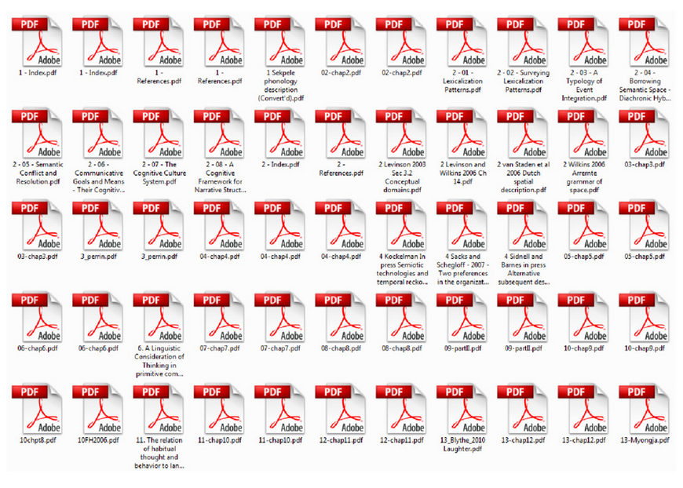
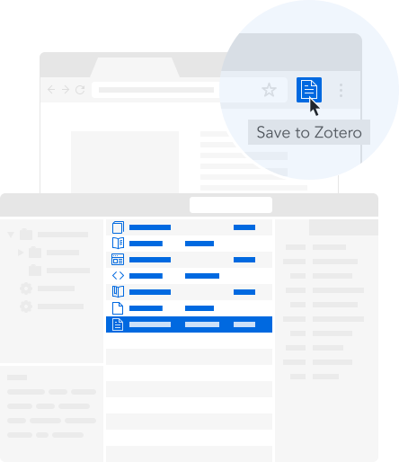
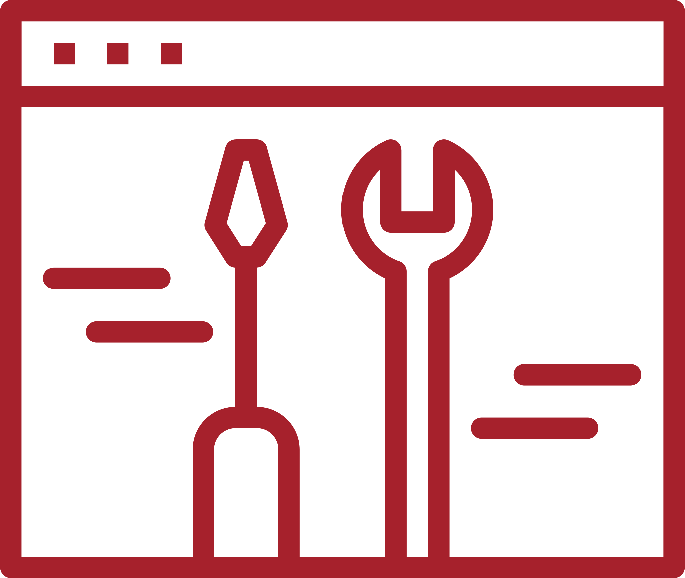
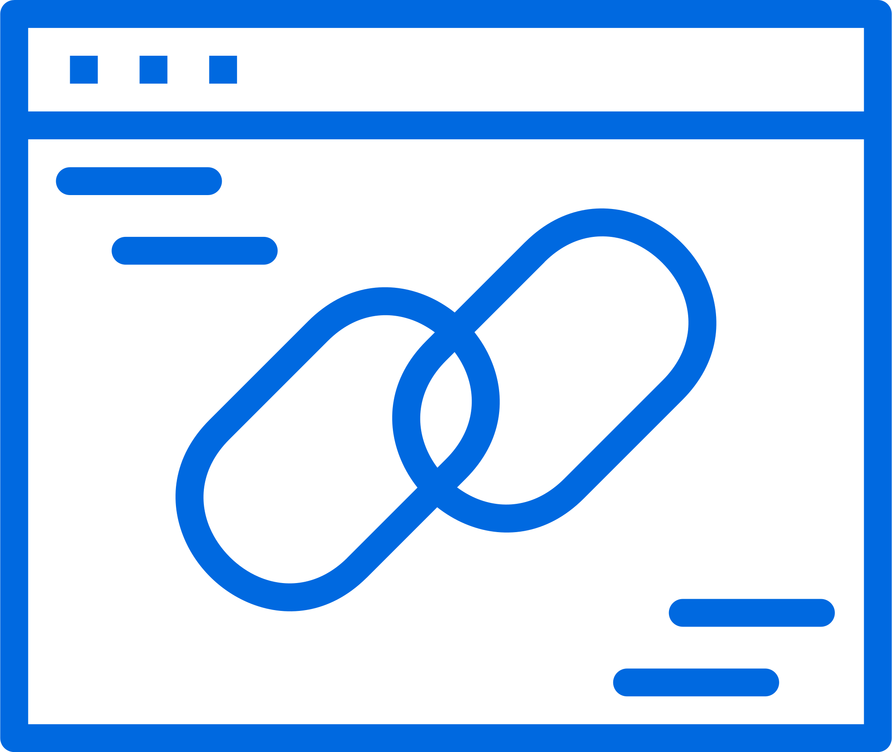
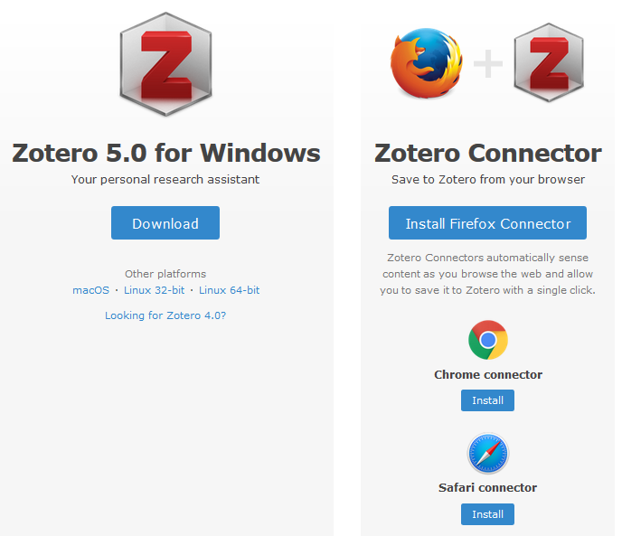
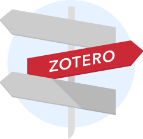

<!-- $theme: default-->
<!-- $size: 16:9 -->

# Zotero et/ou EndNote ?

 

 
:email: votre adresse de messagerie
:telephone_receiver: votre numéro de téléphone

---

# Pourquoi suis-je là ?
Pour répondre à vos questions concernant Zotero et vous présenter les services que nous pouvons vous offrir en lien avec ce type de logiciel. 

---

Zotero appartient en effet à la famille des _reference managers_ à laquelle appartient aussi EndNote. Zotero se révèle tout d'abord 

## un logiciel de gestion bibliographique 
fiable et robuste. 

				

---
## C'est plus encore un _personal research assistant_, 
flexible et adaptable à vos pratiques et habitudes de travail.  

  
  
---

# Mise en garde

## :zap:_Utiliser Zotero pourrait vous exposer à éviter certains problèmes._

La liste suivante n'est pas exhaustive.

---

Acquérir/renouveler une licence logicielle adaptée à votre matériel et votre système d'exploitation, puis financer les mises à jour de version.

---

 

Trouver un outil qui vous permette de collaborer facilement avec vos étudiants et vos collègues.

---

 

Gérer la dispersion et l'absence de liens entre les références biblio, les fichiers des articles (et d'autres fichiers), les notes, etc.

---
# En forme de conclusion avant vos questions

Perkel, J. M. (2015). Eight ways to clean a digital library. _Nature News_, _527_(7576), 123. https://doi.org/10.1038/527123a

> Perhaps the best reason for using a reference manager is the technology’s ability to provide a form of searchable memory. Imagine, says Boyd Steere, a senior research scientist at pharmaceutical firm Eli Lilly in Indianapolis, Indiana, a desk piled high with printed papers: Post-it notes hanging out, writing in the margins, doodles, notations, arrows and more. Today’s PDF-filled, digital folders are in many ways no easier to navigate. With a digital reference manager, however, buried knowledge is just a keyword search away.

---

# Prêt/e ? Installer Zotero
A partir de la page <https://www.zotero.org/download> **2** composants doivent être installés :
* le logiciel Zotero, application indépendante du navigateur,
* le connecteur adapté à votre navigateur, **Chrome, Firefox ou Safari**.

---

# En savoir plus sur Zotero et EndNote

:gb: [Why Zotero ?](https://www.zotero.org/why) sur le site Zotero 
:fr: [Pourquoi Zotero ?](https://zotero.hypotheses.org/1998) sur le blog Zotero francophone
 

 

:briefcase: [Migration vers Zotero](https://zotero.hypotheses.org/2766) sur le blog Zotero francophone

---

# Crédits

  

**Auteur**
Collectif de la [rédaction du blog Zotero francophone](https://zotero.hypotheses.org/credits)

 

**Images**
Icônes : popcornats sur Iconfinder - CC-BY-NC - source : https://www.iconfinder.com/iconsets/minimal-business-line

Visuels : site [Zotero](https://www.zotero.org/)
